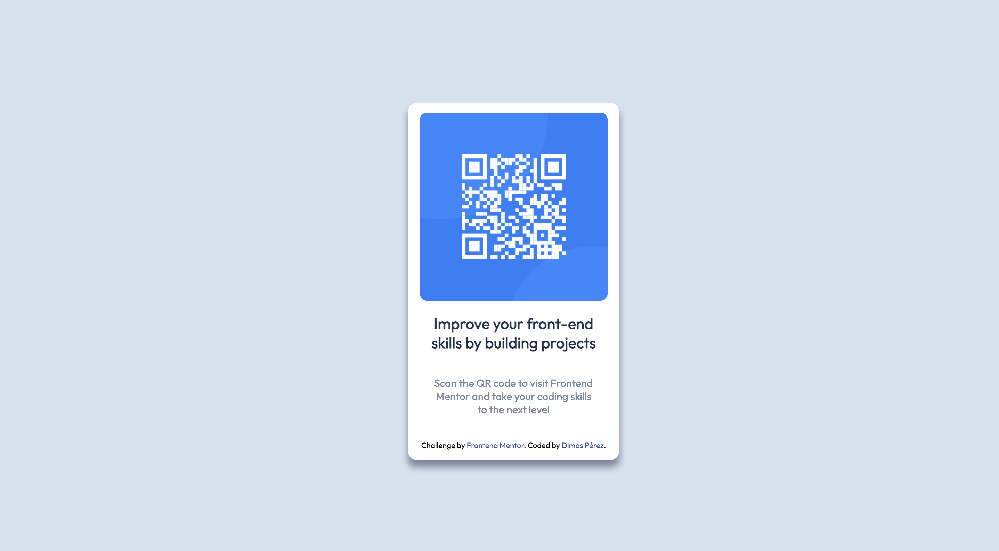

# Frontend Mentor - QR code component solution

This is my solution to the [QR code component challenge on Frontend Mentor](https://www.frontendmentor.io/challenges/qr-code-component-iux_sIO_H). Frontend Mentor challenges help you improve your coding skills by building realistic projects.

## Table of contents

- [Overview](#overview)
  - [Screenshot](#screenshot)
  - [Links](#links)
- [My process](#my-process)
  - [Built with](#built-with)
  - [What I learned](#what-i-learned)
  - [Continued development](#continued-development)
  - [Useful resources](#useful-resources)
- [Author](#author)
- [Acknowledgments](#acknowledgments)

**Note: Delete this note and update the table of contents based on what sections you keep.**

## Overview

### Screenshot



### Links

- Solution URL: [Add solution URL here]()
- Live Site URL: [Add live site URL here]()

## My process

### Built with

- Semantic HTML5 markup
- CSS custom properties
- Flexbox

### What I learned

Apparently it seemed an easy project but it pushed me to find appropiate ways to correctly position the content matching with provided design.

I used flexbox for that purpose, being the most relevant properties shown below:

```css
body {
  align-items: center;
  background-color: hsl(212, 45%, 89%);
  display: flex;
  font-family: "Outfit", sans-serif;
  justify-content: center;
  overflow: hidden;
  width: 100%;
  height: 100%;
  min-height: 100vh;
}

.qr-card {
  background-color: hsl(0, 0%, 100%);
  text-align: center;
  box-shadow: 0px 10px 10px 1px hsl(220, 15%, 55%);
  border-radius: 10px;
  width: 275px;
  top: 30%;
  padding: 5%;
}
```

### Continued development

In this project, there is only one section to work on so next steps will be on improving styling and position in a larger one.

### Useful resources

- [A Complete Guide to Flexbox](https://css-tricks.com/snippets/css/a-guide-to-flexbox/) - This helped me to grasp flex display principles.

## Author

- Frontend Mentor - [@dimasph](https://www.frontendmentor.io/profile/dimasph)
- Twitter - [DimasPerezH](https://www.twitter.com/DimasPerezH)
